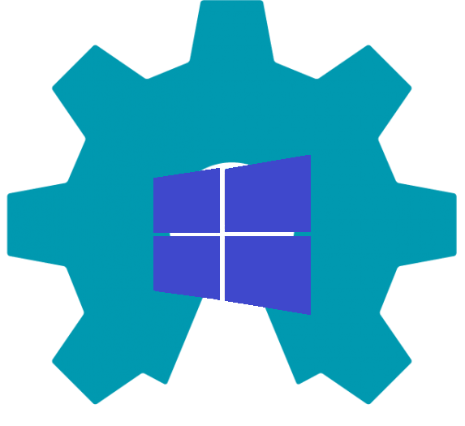
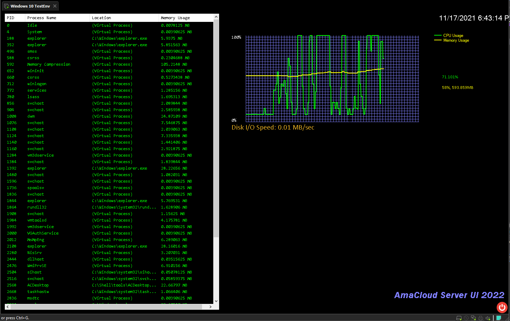

# AdminCon - 基于.NET Framework开发的Windows命令行壳层

<center></center>

## 项目简介

AdminCon（Administrative Console）是一款基于.NET Framework开发的软件，用于替代Windows的图形化壳层（文件资源管理器， explorer.exe），实现少图形界面甚至无图形界面的管理员操作。

本项目是安大略理工大学（Ontario Tech Univ.）2019届计算机科学系学生Ben Wang的阶段考核作品，已开放全部源代码。


## 面向的操作系统平台

Windows 7（需手动安装.NET Framework 4.0）以及NT内核版本号6.1以上的所有Windows x86/x64版本。

Win32版本的AdminCon仅支持已安装64位VC++ 2010 Redistributable及更高版本的Windows。

## 最新发行版下载

[Version 7.0 - Raiden Mei](https://gitee.com/itaruotaku/AdminCon-LTS/archive/refs/tags/v2022.zip)

[Version 7.0 - Raiden Mei (Source Code Only)](https://gitee.com/itaruotaku/AdminCon-LTS/archive/refs/tags/v2022.zip)

```bash
git clone https://gitee.com/itaruotaku/AdminCon-LTS
```


## 主要功能介绍

AdminCon有以下主要功能：

### Windows进程管理

- 进程搜索（根据进程名称或内存使用量查找进程实体）
- 进程创建（运行指定位置的应用程序或服务）
- 进程杀死（根据进程id或名称杀死指定进程实体）
- 了解进程（内存使用量，文件位置）
- 进程列出（按一定顺序打印全部进程，以及每个进程的id，名称，内存使用量）

### 磁盘管理

- 磁盘格式化
- 整理磁盘碎片

### 计算机性能监控

- CPU使用率监控
- 磁盘读写速度监控
- 内存使用量监控
- 剩余可用内存监控

### 图形操作界面

如果想更加方便地使用AdminCon，可以使用图形操作界面来完成一些基本的操作。


## 如何启动项目

此项目是使用Visual Studio Community 2019开发的.NET Framework项目，所以只需要git clone之后点击sln文件即可。在Visual Studio界面中直接点击“运行”即可完成编译和运行。


## 如何使用AdminCon

AdminCon是一个命令行工具，用于替换Windows操作系统的explorer壳层（尤其是Windows服务器），实现全命令行操作，所以使用AdminCon也需要学习一些命令和它们的语法（大小写不敏感）。


### 在你的机器上部署AdminCon

1. 首先下载AdminCon的最新发行版，解压到特定路径之后**将此路径加入path**。

2. 在注册表中修改系统Shell（Computer\HKEY_LOCAL_MACHINE\SOFTWARE\Microsoft\Windows NT\CurrentVersion\Winlogon，在右侧的Shell项中将explorer.exe更改成ac.exe）。

3. 如果重新登录后ac.exe无法替代explorer自动启动，参考这篇教程：

   https://developer.aliyun.com/article/259414

   将教程中的cmd.exe改成ac.exe。

4. 部署成功后，重新登录时将不再加载桌面，ac.exe的命令行窗口将替代文件资源管理器履行系统壳层的职责。


### 开始学习AdminCon命令和语法

在我们开始之前，需要注意：

- AdminCon脚本不支持注释。
- ”/s“ 表示参数类型为string，”/i“ 表示参数类型为int，”/d“ 表示参数类型为逻辑分区。
- [PID] [PNAME] [PATH]等仅用来描述所需参数的含义。
- 某些命令标题中会给出这个命令的英语词根，方便理解。

AdminCon的程序文件： AC.EXE

### 涉及进程操作的命令

- **KILL - 杀死进程**

语法：

```AdminCon
kill /i [PID]   --杀死进程id为[PID]的进程实体。
kill /s [PNAME] --杀死进程名称为[PNAME]的一组进程实体。
```

例：

```AdminCon
kill /s explorer --杀死进程“explorer”及其所有子进程；
kill /i 10123    --杀死进程id为10123的进程，其它同名进程不会受到影响。
```


- **RUN - 开启进程**

语法：

```AdminCon
run /s [PNAME]   --运行[PNAME]进程（位置在path里面）。
run /s [PATH]    --运行指定位置的某个可执行文件，或打开某个文件。
```

例：

```AdminCon
run /s taskmgr   --运行任务管理器（taskmgr.exe在系统path中）；
run /s "C:\Users\User\Document\demo.exe" --运行此位置的某个程序。
```


- **GETPID - 获取一组进程实体的id**

语法：

```AdminCon
getpid /s [PNAME] --获取所有名为[PNAME]的进程实体，并输出它们的id。
```

例：

```AdminCon
getpid /s svchost --获取所有名为“svchost”的进程实体并输出它们的id。
```


- **GETMEM - Get Memory，获取一个/一组进程实体的内存使用量**

语法：

```AdminCon
getmem /s [PNAME] --获取[PNAME]进程及其子进程的全部内存使用量。
getmem /i [PID]   --获取id为[PID]的某个进程实体的内存使用量。
```

例：

```AdminCon
getmem /s svchost --获取svchost及其子进程的内存使用总量；
getmem /i 3346    --获取id为3346的进程的内存使用量。
```


- **LISP - List Processes，tasklist命令在AdminCon上的实现**

语法：

```AdminCon
lisp    --以默认方式（根据进程id）对当前所有进程排序并输出。
lisp -i --等效于lisp。
lisp -m --根据内存使用量的大小对当前所有进程排序并输出。
```


- **FIND - 寻找进程实体**

语法：

```AdminCon
find /s [FUZZY_NAME] --根据提供的[FUZZY_NAME]对进程进行模糊查询。
find /i [MIN]-[MAX]  --查询内存使用量在[MIN]MBytes至[MAX]MBytes之间的所有进程。
```

例：

```AdminCon
find /s ex      --寻找所有名称中包含”ex“的进程及其子进程；
find /i 100-300 --寻找所有内存使用量在100MB到300MB之间的进程。
```


### 涉及管理员操作的命令

- **FDISK - Format Disk，格式化某个逻辑分区**

语法：

```AdminCon
fdisk /d [DRIVE] --格式化[DRIVE]逻辑分区。
```

例：

```AdminCon
fdisk /d E:      --格式化E:。
```


- **DFRG - Defrag，清理某个逻辑分区的磁盘碎片**

语法：

```AdminCon
dfrg /d [DRIVE] --清理[DRIVE]逻辑分区的磁盘碎片。
```

例：

```AdminCon
dfrg /d E:      --清理E:的磁盘碎片。
```


- **PERFSTAT - Performance Status，获取计算机当前的性能数据**


- **TIME - 获取当前时间**


- **PING - ping命令在AdminCon上的实现**

语法：

```AdminCon
ping /s [IP_ADDRESS] --向[IP_ADDRESS]这个ip地址（或域）发送TCP数据包。
```

例：

```AdminCon
ping /s 192.168.0.1
ping /s localhost
ping /s google.com
```


- **WINFO - Windows Info，获取此计算机的系统信息**


- **HEX - 以十六进制的方式查看二进制文件**

语法：

```AdminCon
hex /s [FILE_PATH]
```

例：

```AdminCon
hex /s C:\Users\User\demo.exe
```


### 向你的操作系统发送信号（V8.0 beta）

- **SHUTDOWN - 向操作系统发送关机信号**

语法：

```AdminCon
shutdown /i [secs] --[secs]秒后关机
```

例：

```AdminCon
shutdown /i 300 --300秒后关机
```


- **REBOOT - 向操作系统发送重启信号**

语法：

```AdminCon
reboot /i [secs] --[secs]秒后重启
```

例：

```AdminCon
reboot /i 300 --300秒后关机
```


- **HIBERNATE - 向操作系统发送休眠信号（如果支持休眠）**

  

- **LOGOUT - 登出当前用户**


### 功能型关键字

- **ECHO - 打印一个字符串**

语法：

```AdminCon
echo [TEXT]
```

例：

```AdminCon
echo Hello-World!
```


- **CLS - Clear Screen，清空当前命令行窗口**


- **DELAY - 在脚本中使当前程序停止一段时间**

语法：

```AdminCon
delay /i [NUMBER] --使当前程序停止[NUMBER]毫秒。
```

例：

```AdminCon
delay /i 3000     --使当前程序停止3000ms。
```


- **UI - 打开图形化界面**


- **INFO - 展示此AdminCon的版本信息**


- **PAUSE - 在脚本中暂停，直到按下任意键**


- **BEEP - 哔一声**


- **ACW32 - 打开Win32版本的AdminCon**

注：Win32版本的AdminCon程序名称：ACWIN32.EXE，位于安装路径的Tools文件夹。


- **REST - Restart，重新启动AdminCon**


- **EXIT - 关闭AdminCon**


### 其它

1. AdminCon支持批处理脚本。脚本文件拓展名为.acs。需要手动设置.acs文件默认由此程序（ac.exe）打开。
2. AdminCon有下列命令行启动参数：
   - 安全模式：ac.exe -s
   - 查看版本信息：ac.exe -info
   - 查看帮助：ac.exe /?
   - 直接启动Win32版本：ac.exe -w32
   - 直接以图形模式启动：ac.exe -ui

## AdminCon v6.0版本新功能

<center></center>

在最新发布的6.0版本中，我们删除了一些不好的功能，并添加了一些全新的功能。

### 更新内容概述：

#### 1. 新功能：应用程序注册

在以往版本中，我们发现了一个严重的问题：

由于AdminCon设计的初衷是作为Windows操作系统图形界面的替代品，这就要求我们的产品必须提供较完整的功能支持，而每一次添加新的功能和命令需要长达数天甚至数月的开发，这将需要巨大的工作量和漫长的时间来对其进行完善。

为了方便后续开发，以及增加AdminCon的可扩展性，方便用户对AdminCon的定制化，我们在AdminCon中添加了“应用程序注册”的功能，方便用户将自己的程序注册到AdminCon。

在我们后续的开发中，如非必要，我们将不再向AdminCon中添加代码。新功能将会以一个全新的应用程序的形态注册到AdminCon。


**如何将应用程序注册到AdminCon？**

首先，将你需要使用的可执行程序放在安装路径的tools文件夹下。

在安装路径下的config文件夹有一个toolregist.acfg文件。用记事本打开后可以看到：

```AdminCon Configuration
[TOOL REGISTRY]
# Format: {program-filename,command}
# Not Case Sensitive.
{demo.acs,demo}
{demo2.cmd,demo2}
{demo3.exe,demo3}
```

想要注册你在tools文件夹下的应用程序，需要在新的一行按照上述格式注册。

- 逗号左边是你放在tools文件夹下可执行文件的全名；
- 逗号右边是你在AdminCon中启动该可执行文件时需要输入的命令；
- 键和值均不能为空；
- 大括号内的键值之间使用英文半角的逗号隔开；
- 不能在键值对所在行的两端或者中间添加空格。

举例：

如果需要注册tools文件夹下的MyApplication.exe，需要添加如下行：

```AdminCon Configuration
{MyApplication.exe,myapp}
```

重启AdminCon之后就可以输入myapp命令运行该应用程序了。

#### 2. 删除了script和memstat命令

AdminCon从4.0版本开始支持脚本。以往版本中，运行脚本的方式只有一种，就是在安装目录的script文件夹下放置编写好的.acs脚本，然后通过script命令来运行它。这种不合理的设计在v6.0版本中被移除了。你现在可以在计算机的任意一个位置运行.acs脚本，而不用将其放置在安装目录下。

为了让用户能实时获取更详细的计算机资源使用率，我们移除了仅能查看内存状态的memstat命令，更改成了可以查看CPU/磁盘/内存使用率的perfstat命令。

#### 3. 后续大更新预览

我们预计将在v7.0中增加以下功能：

**ACRemote + ACReceiver服务**

ACRemote + ACReceiver的组合将会实现同一局域网下一台计算机对另一台计算机的控制。你将在ACRemote的命令行界面中输入NT命令或Powershell命令，ACRemote将会把命令发送给目标计算机的服务程序ACReceiver，再由ACReceiver通过目标计算机上的cmd/Powershell执行你输入的命令，实现远程控制。


**计算资源实时可视化 - ACWatchdog**

由于perfstat命令只有在输入后才能查看瞬时使用率，我们计划在v7.0中添加ACWatchdog，用于以饼状图或者柱状图的形式实现计算资源使用率的实时展示。


## AdminCon v7.0版本新功能

<center></center>

在7.0（Raiden Mei）版本中，我们添加了一些功能和小工具：

#### 1. 小工具：DClock-磁盘测速

使用DClock就可以获取系统当前磁盘I/O的均速，得出的数据会更加适合作为磁盘性能的参考。

在AdminCon中的启动命令（可通过toolregist.acfg更改启动命令）：

```AdminCon
ac:root/cli> dclock
```


#### 2. 小工具：ACWatchDog-计算资源实时可视化工具

使用ACWatchDog可以以柱状图的形式实时查看CPU和内存使用率。

在AdminCon中的启动命令（可通过toolregist.acfg更改启动命令）：

```AdminCon
ac:root/cli> watchdog
```


#### 3. 小工具：HexViewer和WebViewer

HexViewer可以将二进制文件以16进制字节码的形式查看；

WebViewer内置一个浏览器控件，可以将您导引到分别位于**Gitee**、**GitHub**和**Azure DevOps**的AdminCon-LTS代码仓库。

**HexViewer在AdminCon中的启动命令被预定义好了**，所以无法通过toolregist.acfg更改（hex命令）。

WebViewer在AdminCon中的启动命令（可通过toolregist.acfg更改启动命令）：

```AdminCon
ac:root/cli> acweb
```

#### 

#### 4. 新功能：AmaCloud Server UI 2022 Preview (AdminCon DeskEnv)

**AmaCloud Server系列**原本是指搭载了Project Amadeus开发的系列工具的Windows服务器的定制化操作系统。

在7.0版本中，我们为AdminCon的工具箱添加了一款可以实时查看进程信息和计算资源的桌面环境：**AmaCloud Server UI 2022**.



###### 在VMware Workstation Pro的Windows 10虚拟机中搭载的AmaCloud Server UI

后续我们将继续完善此功能，以便为管理员们提供更好的操作体验。


#### 5. （重磅）新功能：PizzaCake Package Manager 1.0 beta

<center></center>

**PizzaCake安装包管理器**也是一款基于.NET Framework构建的命令行应用程序，能够极大地方便用户部署系统之后安装缺失的运行环境或SDK。目前的PizzaCake的beta版本仅支持下载exe和msi安装包。

已注册的可下载的运行环境，SDK和开发工具有：

- **Microsoft .NET Runtimes & SDKs**
  - .NET Framework 4
  - .NET 5 Desktop Runtime
  - .NET 5 SDK
  - .NET 6 Desktop RunTime
  - .NET 6 SDK
- **Microsoft Visual C++ Redistributables**
  - Visual C++ 2005 Redist (x86, x64)
  - Visual C++ 2008 Redist (x86, x64)
  - Visual C++ 2010 Redist (x86, x64)
  - Visual C++ 2012 Redist (x86, x64)
  - Visual C++ 2015 Redist (x86, x64)
- **JREs and JDKs**
  - Java 8 Runtime
  - OpenJDK 8
  - OpenJDK 11
- **Python**
  - Python 2.7
  - Python 3.8
- **Golang**
  - Go 1.17.3
- **Dev Tools**
  - VSCodium
  - Intellij IDEA Community 2021
  - PyCharm Community 2021
  - WebStorm

**PizzaCake 命令语法**

搜索安装包（模糊查询）：

```PizzaCake
pkg search [pkg-fuzzyname]
```

查看所有已注册的安装包：

```PizzaCake
pkg search *
```

安装一个包：

```PizzaCake
pkg install [pkgname]
```

清除所有已下载的包：

```PizzaCake
pkg clear all
```


**PizzaCake 配置文件**

PizzaCake的配置文件位于可执行程序的同一目录下，文件名为pkgmapping.pml。

pkgmapping.pml 主要包括以下部分：

1. 全局配置，确定了下载的安装包保存的位置和是否自动解包并安装；
2. 镜像站点，将在后续的功能开发中用到；
3. URL映射，每个包名都会映射到一个网络上的位置。当pizza install + 包名的时候就会从该url下载文件。添加URL映射的过程又叫”**注册包**“。

如果需要更改全局配置，在pkgmapping中找到”[Global Config]"标签，更改下方的字段即可。

```properties
# AdminCon CLI - PizzaCake Package Manager - Package Locator File

[Global Config]

###########################################################################
# ATTENTION!                                                              #
# 1. Always use single-back-slash. It's easier for the program to analyze.#
# 2. No double quotes ("), spaces or semicolons (;) are allowed here.     #
# 3. Absolute path only, no extra back-slash at the end.                  #
###########################################################################

#保存安装包的位置，只能是绝对路径，且path末尾不要添加额外的反斜杠。
SaveLocation=C:\packages

#是否自动安装。如果设为false，将只打开下载完成的包所在的文件夹，需要手动点击安装。
AutoInstall=true
```

接下来可以在[Package Install]标签下的内容中添加URL映射了，方法和注册工具到AdminCon的方法相似，都是以键值对的形式存储，且同一行内不能出现空格，大括号之外也不能有多余的内容，键和值之间使用逗号分隔。

```properties
[Package Install]
# {package-name,download-url}
# Microsoft .NET
{dotnetfx4,https://download.microsoft.com/download/1/B/E/1BE39E79-7E39-46A3-96FF-047F95396215/dotNetFx40_Full_setup.exe}
{dotnet5RT,https://download.visualstudio.microsoft.com/download/pr/1daf85dc-291b-4bb8-812e-a0df5cdb6701/85455a4a851347de26e2901e043b81e1/windowsdesktop-runtime-5.0.12-win-x64.exe}
{dotnet6RT,https://download.visualstudio.microsoft.com/download/pr/a865ccae-2219-4184-bcd6-0178dc580589/ba452d37e8396b7a49a9adc0e1a07e87/windowsdesktop-runtime-6.0.0-win-x64.exe}
{dotnet5sdk,https://download.visualstudio.microsoft.com/download/pr/5303da13-69f7-407a-955a-788ec4ee269c/dc803f35ea6e4d831c849586a842b912/dotnet-sdk-5.0.403-win-x64.exe}
{dotnet6sdk,https://download.visualstudio.microsoft.com/download/pr/0f71eaf1-ce85-480b-8e11-c3e2725b763a/9044bfd1c453e2215b6f9a0c224d20fe/dotnet-sdk-6.0.100-win-x64.exe}
```

[End of Document]标签是文档尾部的定位标签，不要删除或更改。

（注：其实除了[Glocal Config]标签下的内容外，其它位置的内容只应由本软件的开发者更新。用户更改不当可能会造成严重的bug，望知悉。）


## AdminCon 2023 v8.0

- 修复了一些bug和拼写错误
- 重写了更合适的UI（详见UserInterface.cs）
- 优化了部分算法


## 联系我们

网易邮箱：

dev_projectamadeus@163.com

wangzy20011115@163.com

outlook：

dev.projectamadeus@outlook.com

gmail:

koizuminankaze@gmail.com(Abandoned)(已废弃)

github:

https://github.com/itaruotaku

https://github.com/memeoverdoseexception

<center></center>


Project Amadeus Dev Team<br>
Nov. 15st, 2021